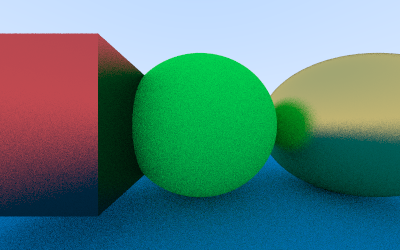
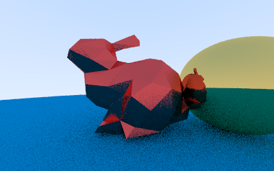
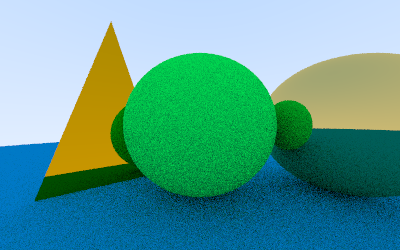
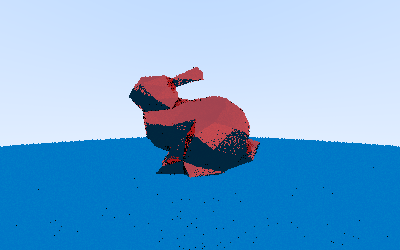

# 简易光线追踪软渲染器

## 渲染效果





## 开始渲染

```shell
git clone https://github.com/AEMShana/RayTracing.git
cd ./RayTracing
g++ -I "./Eigen3" -I "./stb" main.cpp -o main
./main
```

即可在同一目录下得到 `image.png` 文件。

## 参数设置

```cpp
// main.cpp
const int image_width = 400;        // 图像宽度
const int image_height = 250;       // 图像高度
const int samples_per_pixel = 20;   // 每个像素采样的光线数
const int max_depth = 10;            // 光线弹射的最大次数
```

增大 samples_per_pixel 和 max_depth 将获得更好的渲染效果，但会导致更长的渲染时间。




可以先设置较小的 samples_per_pixel 和 max_depth 以预览渲染效果:




## 加载要渲染的物体

```cpp
// main.cpp

hittable_list world;
// 加入一个球体
world.add(make_shared<sphere>(Vector3d(0, 0, -1), 0.5, make_shared<lambertian>(Vector3d(0.0, 0.9, 0.1))));
// 加入一个三角形
world.add(make_shared<triangle>(Vector3d(-1, -1, -1), Vector3d(1, -1, -1), Vector3d(0, 1, -1), make_shared<metal>(Vector3d(0.8, 0.1, 0.1), 0.3)));

// 加入一个obj模型 (建议少面数的模型)
hittable_list cube;
cube.load_obj("./model/cube.obj");
world.add(make_shared<hittable_list>(cube));

```
